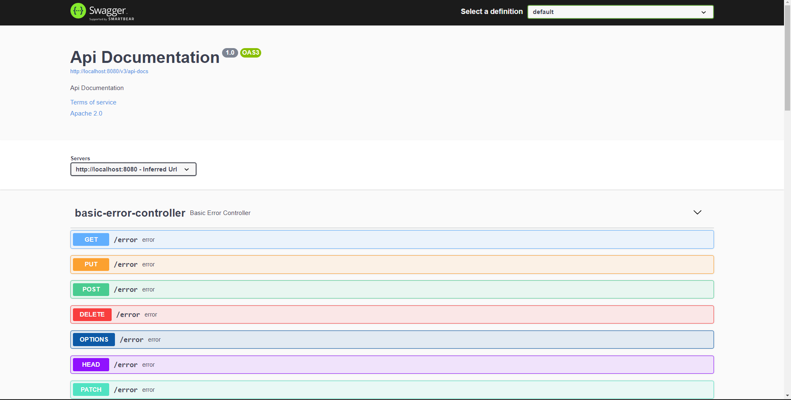
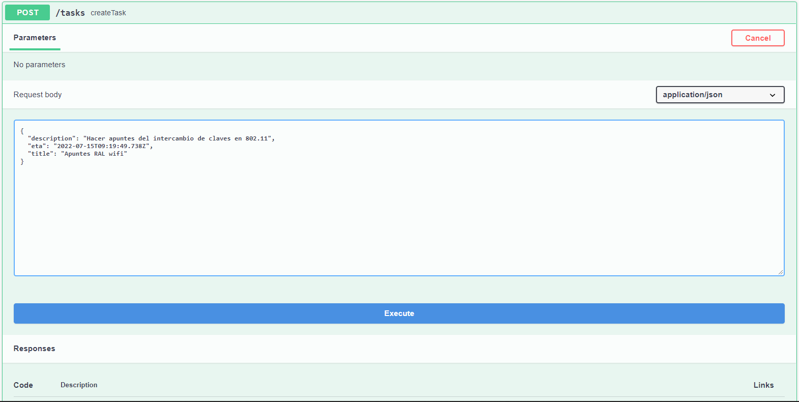
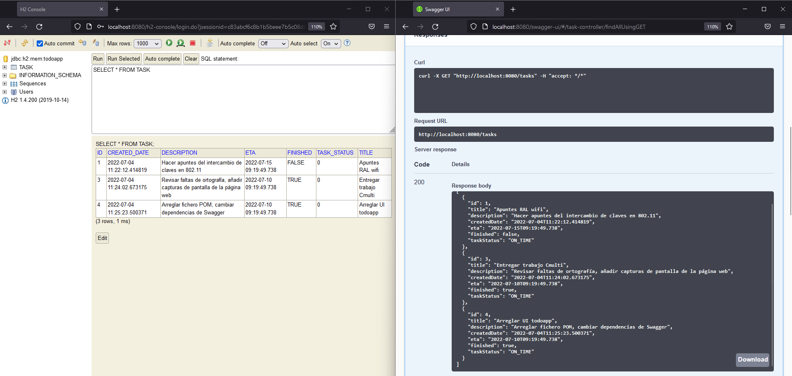
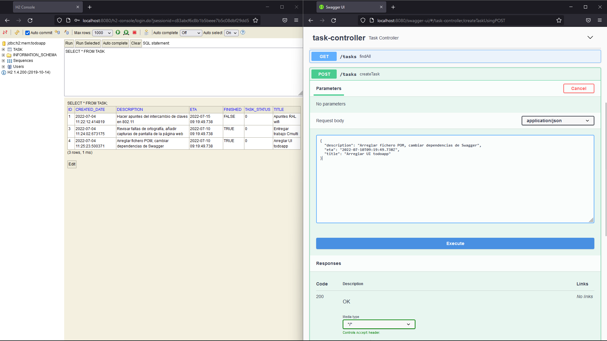

INTRODUCTION
------------

This is my first project using Springboot's framework, a very powerful and intuitive tool that makes backend developing much more lightweight. 

It is focused on recreating a To-Do app, using Swagger for the UI and H2 for database inquiries.

Here are some screenshots of the final result: 

REQUIREMENTS
------------

This module requires no modules, just a terminal or command line apllication, although it is recommended to view the project using an IDE such as IntelliJ.

INSTALLATION
------------
 
 * Clone the repository

 * Cd into /demo
 
 * Run: .\mvnw.cmd spring-boot:run if you are using windows or ./mvnw spring-boot:run if you use GNU/Linux.
 
 
 CONFIGURATION
-------------

You can change the configuration by editing POM.xml

TROUBLESHOOTING
---------------

You should have no problems running the app, provided you followed the previously mentioned steps. 

If you are facing some issues, visit Spring's help page.